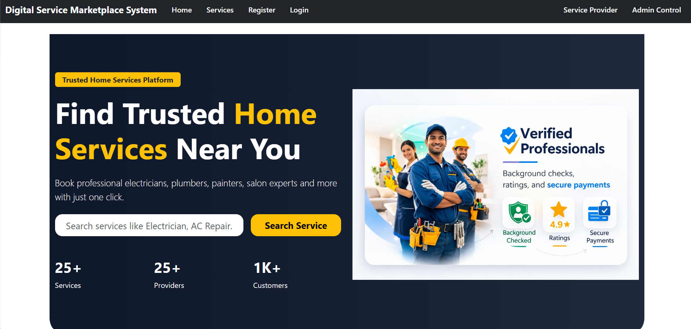

# 🌐 Digital Service Marketplace System

> A Full Stack Web Application developed using **ASP.NET Core MVC**, **C#**, **SQL Server**, **Entity Framework Core**, **HTML**, **CSS**, **Bootstrap**, and **JavaScript**.

---

## 📖 Project Overview

The **Digital Service Marketplace System** is a web-based platform that connects customers with service providers. Users can browse services, book appointments, and manage bookings, while providers can manage their services and booking requests. The Admin has complete control over users, providers, categories, and service approvals.

---

## ✨ Key Features

### 👤 User

* User Registration & Login
* Browse Services
* View Service Details
* Book Services
* View Booking History
* Manage Profile

### 🛠️ Service Provider

* Provider Registration & Login
* Add New Services
* Edit/Delete Services
* Manage Booking Requests
* Update Provider Profile

### 👨‍💼 Admin

* Secure Admin Login
* Manage Users
* Manage Providers
* Manage Categories
* Approve Services
* Monitor Platform Activities

---

## 🛠️ Tech Stack

| Category        | Technologies                         |
| --------------- | ------------------------------------ |
| Frontend        | HTML5, CSS3, Bootstrap 5, JavaScript |
| Backend         | ASP.NET Core MVC, C#                 |
| Database        | SQL Server                           |
| ORM             | Entity Framework Core                |
| IDE             | Visual Studio                        |
| Version Control | Git & GitHub                         |

---

## 📂 Project Structure

```text
Digital-Service-Marketplace-System
│
├── DSM.UI
├── DSM.Repository
├── DSM.Models
└── Internship_Revolution.slnx
```

---

## 🚀 Getting Started

1. Clone the repository.
2. Open the solution in Visual Studio.
3. Update the SQL Server connection string in `appsettings.json`.
4. Apply database migrations.
5. Build and Run the project.

---

## 📸 Project Screenshots

### 🏠 Home Page


### 🔑 User Login


### 👤 User Dashboard


### 🛠️ Provider Login


### 📊 Provider Dashboard


### ➕ Add New Service


### 📋 Services


### 📅 Service Booking Form


### 📨 Booking Requests


### 👨‍💼 Admin Dashboard


### ✏️ Edit Profile


---


## 🚀 Future Enhancements

* Online Payment Gateway
* Email Notifications
* Ratings & Reviews
* Live Chat Support
* AI-Based Service Recommendations

---

## 👩‍💻 Author

**Pratiksha Warekar**

🎓 MCA Student
💻 Full Stack Developer Aspirant

GitHub: https://github.com/Pratiksha-Warekar

---

⭐ If you found this project useful, consider giving it a **Star**.
